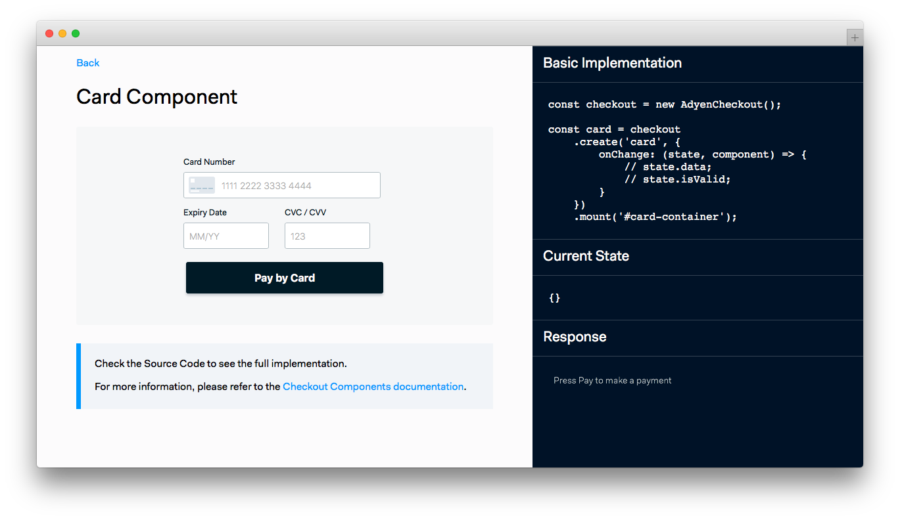

# Adyen Components sample code



> ⚠️ **This repository is for demo purposes only**

## Requirements

To run this project, **create** a `.env` file on your project's root folder following the example on `.env.default`.

```
MERCHANT_ACCOUNT=MyMerchantAccount
CHECKOUT_APIKEY=MY_CHECKOUT_API_KEY
```

These variables can be found in Adyen Customer Area. For more information, visit our [Get started with Adyen guide](https://docs.adyen.com/payments-essentials/get-started-with-adyen).

## Installation

### Running the PHP Server

Navigate to the root of the project and run the `start.sh` script:

```
$ cd adyen-components-js-sample-code
$ ./start.sh
```

A PHP server will start on `http://localhost:3000`.

### Running the Node.js Server

If preferred, you can run a Node.js server instead.
To do this, navigate to the root of the project, install the dependencies (only the first time) and run the start script:

```
$ cd adyen-components-js-sample-code
$ npm i
$ npm start
```

A Node.js server will start on `http://localhost:3000`.

### Deploying this example to Heroku

Alternatively, you can install this example by using this shortcut to deploy to Heroku:

[](https://heroku.com/deploy?template=https://github.com/Adyen/adyen-components-js-sample-code)

## Documentation

For the complete integration guide, refer to the [Web Components documentation](https://docs.adyen.com/checkout/components-web/).

## License

This repository is open source and available under the MIT license. For more information, see the LICENSE file.
